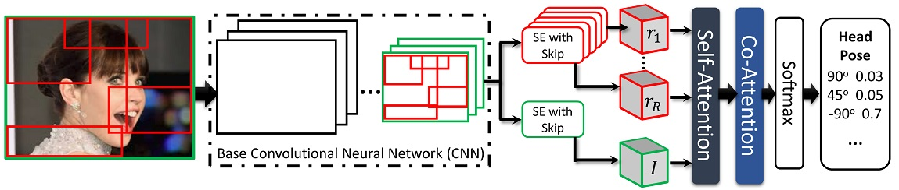
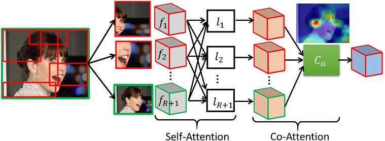

## Regional Attention Network (RAN) for Head Pose and Fine-grained Gesture Recognition
**Ardhendu Behera, Zachary Wharton, Yonghuai Liu, Morteza Ghahremani, Swagat Kumar and Nik Bessis**<br>
**_Department of Computer Science, Edge Hill University, United Kingdom_**

### Abstract
Affect is often expressed via non-verbal body language such as actions/gestures, which are vital indicators for human behaviors. Recent studies on recognition of fine-grained actions/gestures in monocular images have mainly focused on modeling spatial configuration of body parts representing body pose, human-objects interactions and variations in local appearance. The results show that this is a brittle approach since it relies on accurate body parts/objects detection. In this work, we argue that there exist local discriminative semantic regions, whose ``informativeness" can be evaluated by the attention mechanism for inferring fine-grained gestures/actions. To this end, we propose a novel end-to-end **Regional Attention Network (RAN)**, which is a fully Convolutional Neural Network (CNN) to combine multiple contextual regions through attention mechanism, focusing on parts of the images that are most relevant to a given task. Our regions consist of one or more consecutive cells and are adapted from the strategies used in computing HOG (Histogram of Oriented Gradient) descriptor. The model is extensively evaluated on ten datasets belonging to 3 different scenarios: 1) head pose recognition, 2) drivers state recognition, and 3) human action and facial expression recognition. The proposed approach outperforms the state-of-the-art by a considerable margin in different metrics. 


### Regional Attention Network (RAN)
The method is based on the hypothesis that there is a benefit to exploring salient regions and amplifying their influence while suppressing the potentially noisy and irrelevant information in other regions. In particular, we reveal that enforcing a more focused and parsimonious use of image information could efficiently aid in discriminating subtle changes that are often observed in fine-grained action recognition tasks. Therefore, the proposed end-to-end attention-aware fine-grained classification network uses a collection of regional CNN features, dynamically weighted by the compatibility scores in classifying fine-grained actions/gestures. It leads to significant improvements in classification accuracy over the baseline architectures and state-of-the-art approaches on three separate fine-grained action/gesture recognition tasks: 1) head pose, 2) driver’s distraction activities, and 3) human actions and facial expressions in still images.


**Architecture of our RAN. Given an image, we select a set of candidate regions. The image is passed through a base CNN. The output activation of a given region _r_ is computed using specialized Squeeze-and-Excitation layer with skip connection. For each gesture _g_ (head pose example), the most informative region is selected using the proposed attention layer consisting of _self-attention_ and _co-attention_ representing combined attention of regions and the whole image. The softmax operation transforms co-attention-focused activations into probabilities that form the final prediction.**

<p align="center">

</p>
**Computation of the proposed self-attention and co-attention from the feature maps representing the ROIs and the whole image. The input to the attention layer is the output from the proposed SE with a skip connection layer focusing on the respective ROIs and the whole image.**

### Paper and Supplementary Information
Extended version of the accepted paper in [ArXiv](https://arxiv.org/pdf/2101.06634).

### Bibtex
```markdown
@article{behera2020regional,
  title={Regional Attention Network (RAN) for Head Pose and Fine-grained Gesture Recognition},
  author={Behera, Ardhendu and Wharton, Zachary and Liu, Yonghuai and Ghahremani, Morteza and Kumar, Swagat and Bessis, Nik},
  journal={IEEE Transactions on Affective Computing},
  year={2020},
  publisher={IEEE}
}
```

### Acknowledgements

This research was supported by the UKIERI (CHARM) under grant DST UKIERI-2018-19-10. The GPU is kindly donated by the NVIDIA Corporation.
